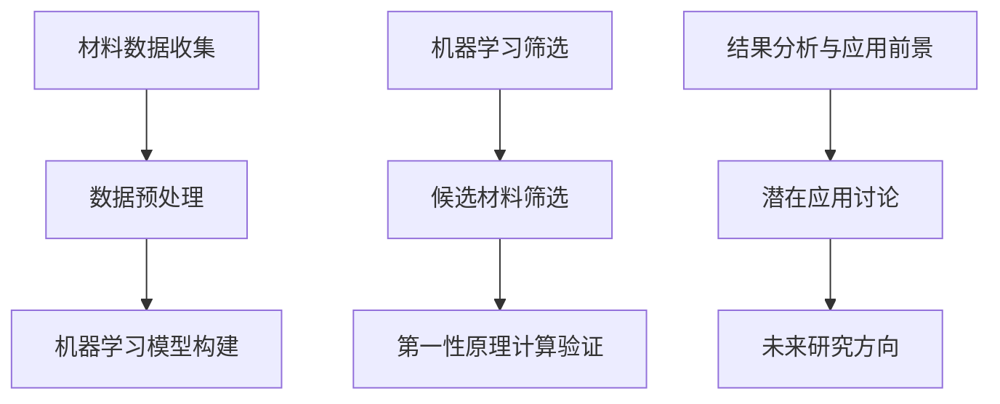

## Knowledge and Problem Conclusion

### Constructive
#### Deque
* [CF1899F](https://codeforces.com/contest/1899/problem/F)

#### Index & Value (index combine with the value of the list)
* [CF1856C](https://codeforces.com/contest/1856/problem/C)

#### Matrix
* [CF1956C](https://codeforces.com/contest/1956/problem/C)

#### Median
* [CF433C](https://codeforces.com/contest/433/problem/C)

#### Repetend (some elements repeat in the loop)
* [CF314B](https://codeforces.com/contest/314/problem/B)
* [CF641C](https://codeforces.com/contest/641/problem/C)

### Data Structure

### Dynamic Programming
#### Waiting to classify
* [CF1920E](https://codeforces.com/contest/1920/problem/E)
* [CF1864D](https://codeforces.com/contest/1864/problem/D)
* [CF615B](https://codeforces.com/contest/615/problem/B)

#### Greedy+DP
* [CF1107F](https://codeforces.com/contest/1107/problem/F)

### Greedy
#### Waiting to classify
* [CF852C](https://codeforces.com/contest/852/problem/C)

### Interactive
#### Waiting to classify
* [CF744B](https://codeforces.com/contest/744/problem/B)
* [CF1063C](https://codeforces.com/contest/1063/problem/C)wdddd

### Math
#### Waiting to classify
* [CF309A](https://codeforces.com/contest/309/problem/A)
* [CF281B](https://codeforces.com/contest/281/problem/B)

#### Combination
* [CF559C](https://codeforces.com/contest/559/problem/C): the count of different paths in matrix

#### Fast Power
* [CF1279D](https://codeforces.com/contest/1279/problem/D)

#### Inclusion-Exclusion Principle
* [CF340E](https://codeforces.com/contest/340/problem/E)

### Search
#### Binary Search

#### Trinary Search

#### Depth First Search (DFS)

#### Breadth First Search (BFS)
* [CF682C](https://codeforces.com/contest/682/problem/C)

#### Recall
* [CF1689C](https://codeforces.com/contest/1689/problem/C) | [plus P1041](https://www.luogu.com.cn/problem/P1041): DFS and recall

### String

### Waiting to classify

